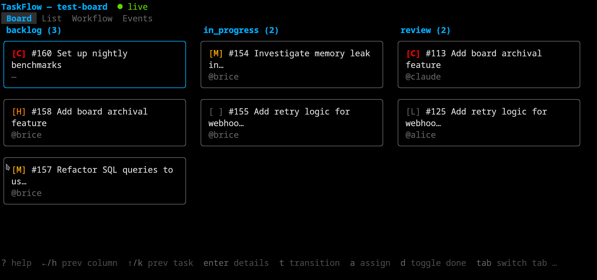
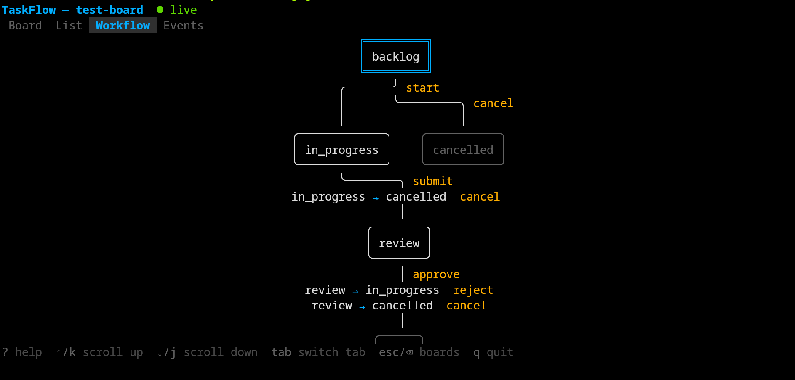

# TaskFlow



**Kanban boards with workflow state machines, built for human + AI collaboration.**

TaskFlow is a task tracker where humans and AI agents work side by side. Tasks live on kanban boards with configurable workflow state machines. Every action — by any actor — is recorded in a full audit trail. Access it via CLI, interactive TUI, MCP for AI agents, or the HTTP API directly.


## Getting Started

### 1. Start the server

```bash
# Option A: Docker Compose
just docker-up

# Option B: Run locally
just build
just run
```

On first start, the server creates a seed admin actor and writes the API key to `seed-admin-key.txt`. The admin name defaults to the value of `TASKFLOW_SEED_ADMIN_NAME` (set to `admin` in docker-compose.yml).

```bash
# Get the seed admin key
cat seed-admin-key.txt                              # local
docker compose exec taskflow cat /data/seed-admin-key.txt  # Docker
```

To set a specific key instead of a random one (useful for CI/automation):

```bash
TASKFLOW_SEED_ADMIN_NAME=admin TASKFLOW_SEED_ADMIN_KEY=my-known-key ./taskflow-server
```

### 2. Configure the CLI

Set the API key for the CLI (and TUI). All three methods work — use whichever fits your setup:

```bash
# Option A: environment variables (good for quick use)
export TASKFLOW_API_KEY=$(cat seed-admin-key.txt)
export TASKFLOW_URL=http://localhost:8374    # default, only needed if server is elsewhere

# Option B: config file (persistent)
mkdir -p ~/.config/taskflow
cat > ~/.config/taskflow/config.yaml <<EOF
url: http://localhost:8374
api_key: $(cat seed-admin-key.txt)
EOF

# Option C: flags (one-off commands)
taskflow --url http://localhost:8374 --api-key <key> board list
```

For Docker Compose, the server is on `localhost:8374` by default. Get the key with:

```bash
export TASKFLOW_API_KEY=$(docker compose exec -T taskflow cat /data/seed-admin-key.txt)
```

### 3. Create a board and tasks

```bash
taskflow board create --slug my-board --name "My Board"
taskflow task create my-board --title "Fix auth bug" --priority high
taskflow task list my-board
taskflow task transition my-board 1 --transition start --comment "On it"
```

### 4. Add more actors

Create actors for team members and AI agents. Each gets their own API key for identity and audit attribution.

```bash
# Create a human member
taskflow actor create --name alice --display_name "Alice Chen" --type human --role member

# Create an AI agent
taskflow actor create --name claude --display_name "Claude" --type ai_agent --role member
```

The API key is returned in the response (shown once). Share it with the actor for their CLI, TUI, or MCP configuration.

### 5. Use other interfaces

```bash
# TUI — interactive terminal UI (uses same config as CLI)
taskflow-tui

# TUI — connect to a specific board directly
taskflow-tui platform

# MCP — AI agent integration (see docs/mcp.md for Claude Code setup)
TASKFLOW_URL=http://localhost:8374 TASKFLOW_API_KEY=<agent-key> taskflow-mcp
```

## Documentation

- **[Architecture](ARCHITECTURE.md)** — package structure, dependency flow, design decisions, event system
- **[HTTP API Reference](docs/http-api.md)** — all endpoints, authentication, error handling, configuration
- **[CLI Reference](docs/cli.md)** — all commands, flags, output formats
- **[TUI Reference](docs/tui.md)** — interactive terminal UI: views, keybindings, live updates
- **[MCP Server](docs/mcp.md)** — AI agent integration via Model Context Protocol
- **[OpenAPI Spec](http://localhost:8374/openapi.json)** — machine-readable, auto-generated from operation definitions
- **[Claude Code Skill](SKILL.md)** — AI agent guide for using TaskFlow via the CLI
- **[Manual QA Checklist](TESTING.md)** — endpoint-by-endpoint verification guide

## Features

- HTTP API with auth (SHA-256 keys), RBAC, idempotency keys, and batch operations
- 43 domain endpoints (19 Resources + 24 Operations) auto-derived from the model
- OpenAPI 3.1 spec auto-generated at startup
- CLI with commands derived from the same model
- Interactive TUI with kanban, list, workflow graph, and live event stream — see **[TUI Reference](docs/tui.md)**
- MCP server for AI agent integration (Claude Code, Aider, Cursor) with notification piggyback — see **[MCP Server](docs/mcp.md)**
- Real-time event streaming (SSE) with before/after task snapshots
- Webhook dispatch with HMAC-SHA256 signatures, retry, and delivery logging
- HTML dashboard at `/dashboard`
- Docker deployment with seed admin bootstrap

See [docs/](docs/) for API, CLI, TUI, and MCP reference.

## Roles

Every actor (human or AI) has a role that determines what they can do:

| Action | `admin` | `member` | `read_only` |
|--------|:-------:|:--------:|:-----------:|
| Manage actors (create, update roles) | ✅ | ❌ | ❌ |
| Manage webhooks | ✅ | ❌ | ❌ |
| Delete/reassign boards | ✅ | ❌ | ❌ |
| View system stats | ✅ | ❌ | ❌ |
| Create boards | ✅ | ✅ | ❌ |
| Update boards and workflows | ✅ | ✅ | ❌ |
| Create/update/transition/delete tasks | ✅ | ✅ | ❌ |
| Add comments, dependencies, attachments | ✅ | ✅ | ❌ |
| Read all data (boards, tasks, audit, etc.) | ✅ | ✅ | ✅ |

Requests that exceed the actor's role receive a `403 Forbidden` response. Each Resource and Operation in the model declares its minimum required role.

## Workflows



Each board has a workflow — a state machine that defines how tasks move through stages. Workflows are specified as JSON when creating a board. If omitted, a default workflow is used.

```
backlog → in_progress → review → done
              ↑            │
              └────────────┘ (reject)
         from any → cancelled
```

```json
{
  "states": ["backlog", "in_progress", "review", "done", "cancelled"],
  "initial_state": "backlog",
  "terminal_states": ["done", "cancelled"],
  "transitions": [
    {"from": "backlog", "to": "in_progress", "name": "start"},
    {"from": "in_progress", "to": "review", "name": "submit"},
    {"from": "review", "to": "done", "name": "approve"},
    {"from": "review", "to": "in_progress", "name": "reject"}
  ],
  "from_all": [
    {"to": "cancelled", "name": "cancel"}
  ]
}
```

| Field | Description |
|-------|-------------|
| `states` | All valid states |
| `initial_state` | State assigned to new tasks |
| `terminal_states` | End states — tasks here are considered closed |
| `transitions` | Explicit state-to-state transitions with named actions |
| `from_all` | Transitions reachable from every non-terminal state |
| `to_all` | Transitions from a specific state to every other state |

Tasks are moved between states by name (e.g. `--transition start`), not by target state. Use `taskflow workflow get <board>` or the TUI's Workflow tab to see available transitions.

### Example workflows

**Content pipeline:**
```json
{"states":["draft","editing","review","published","archived"],"initial_state":"draft","terminal_states":["published","archived"],"transitions":[{"from":"draft","to":"editing","name":"edit"},{"from":"editing","to":"review","name":"submit"},{"from":"review","to":"published","name":"publish"},{"from":"review","to":"editing","name":"revise"}],"from_all":[{"to":"archived","name":"archive"}]}
```

**Incident response:**
```json
{"states":["reported","triaging","investigating","mitigating","resolved","postmortem"],"initial_state":"reported","terminal_states":["postmortem"],"transitions":[{"from":"reported","to":"triaging","name":"triage"},{"from":"triaging","to":"investigating","name":"investigate"},{"from":"investigating","to":"mitigating","name":"mitigate"},{"from":"mitigating","to":"resolved","name":"resolve"},{"from":"resolved","to":"postmortem","name":"review"}]}
```

## Architecture

Operations are defined once in `model.Resources()` and `model.Operations()` and derived into HTTP routes, CLI commands, OpenAPI specs, MCP tools/resources, and the shared `httpclient`. All clients (CLI, TUI, MCP, simulator) are pure HTTP consumers — they import no server internals.

See **[ARCHITECTURE.md](ARCHITECTURE.md)** for the full architectural reference: dependency flow, package responsibilities, event system, query param derivation, and design rationale.

## Development

Requires Go 1.25+ and [just](https://github.com/casey/just).

```
just check          # fmt-check + vet + test (full suite)
just test           # unit + integration + QA smoke test (45 endpoint checks)
just test-unit      # unit + integration tests only (no server startup)
just build          # build all binaries (server, CLI, TUI, MCP)
just run            # start the server locally
just fmt            # format code
just seed           # generate test database

just docker-build   # build Docker image
just docker-up      # start with Docker Compose
just docker-down    # stop
just docker-logs    # follow logs
just clean          # remove build artifacts
```

Set `TASKFLOW_DEV_MODE=true` to disable all rate limiting (useful for testing and development). See [TESTING.md](TESTING.md) for the full manual QA checklist.

### Releasing

```bash
just release v0.1.2
```

This creates an annotated git tag and pushes it. CI then:
1. Runs the full test suite
2. Cross-compiles binaries for linux/amd64, linux/arm64, darwin/amd64, darwin/arm64
3. Creates a GitHub Release with downloadable archives and auto-generated release notes
4. Builds and pushes Docker images tagged `:latest`, `:sha`, and `:v0.1.2`
5. Watchtower deploys the new image to the VPS within 3 minutes

To build release archives locally: `just dist` (outputs to `dist/`).

### Deployment

The server must be hosted at the root of a domain (e.g. `https://taskflow.example.com`). Hosting at a subpath (e.g. `/taskflow`) is not currently supported — the dashboard, OpenAPI spec, and SSE endpoints generate absolute paths without a configurable prefix.

All binaries embed a version string from `git describe` at build time. The server exposes it via the `X-TaskFlow-Version` response header and the `/health` endpoint. Clients warn on stderr if their version differs from the server.

### Testing with the simulator

The activity simulator generates realistic board activity for testing live updates:

```bash
# Terminal 1: server with test database
just seed && just run

# Terminal 2: simulator
go run ./cmd/taskflow-sim --board platform

# Terminal 3: TUI
TASKFLOW_API_KEY=seed-admin-key-for-testing taskflow-tui
```

The simulator performs a weighted mix of creates, transitions, assignments, and comments every 2-8 seconds, acting as multiple actors.
